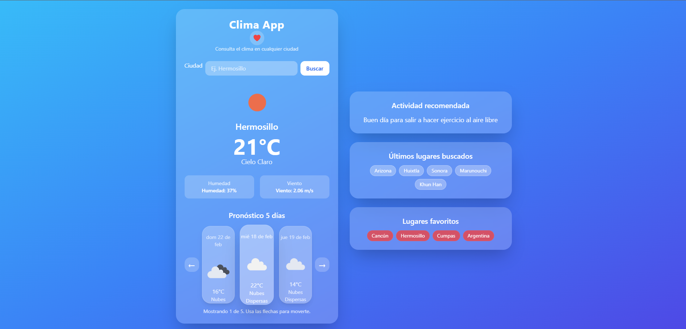
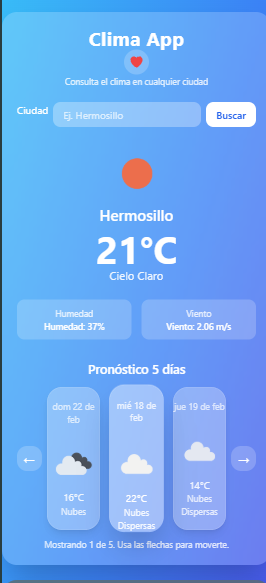
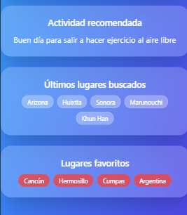

Clima App

Aplicación web que consume la API de OpenWeather para mostrar información del clima en tiempo real de cualquier ciudad.

Características

Búsqueda del clima por nombre de ciudad

Muestra temperatura, descripción del clima, humedad y velocidad del viento

Pronóstico extendido a 5 días

Historial de últimas ciudades buscadas (almacenadas en localStorage)

Gestión de lugares favoritos

Interfaz responsiva desarrollada con Tailwind CSS

Manejo de errores con patrón Retry y Circuit Breaker

Detección de modo offline (navigator.onLine)

Tecnologías utilizadas

JavaScript (Vanilla)

HTML5

Tailwind CSS (CLI)

OpenWeather API

Funcionamiento

La aplicación realiza peticiones HTTP a la API de OpenWeather utilizando fetch.

Incluye mecanismos de resiliencia como:

Reintentos automáticos (Retry) ante fallos temporales

Control de tiempo de espera (Timeout)

Patrón Circuit Breaker para evitar múltiples solicitudes fallidas consecutivas

Validación de conexión a internet

API utilizada

OpenWeather API
https://openweathermap.org/api

Requisitos (solo para desarrollo)

Node.js (versión 16 o superior recomendada, únicamente si se desea editar y recompilar Tailwind)

Tailwind CSS instalado vía npm

Nota: Si solo deseas usar la aplicación sin modificar estilos, no es necesario instalar Node.js.

Screenshots

 

  

Instalación
1- Clonar el repositorio
git clone <url-del-repositorio>
cd nombre-del-proyecto

2- Instalar dependencias
npm install

3- Ejecutar Tailwind en modo desarrollo
npx tailwindcss -i ./src/css/input.css -o ./src/css/output.css --watch

4- Agregar tu API Key de OpenWeather en el archivo scripts.js.

5- Abrir index.html en el navegador.

Proyecto en GithubPages:
https://angelz1305.github.io/Clima 
